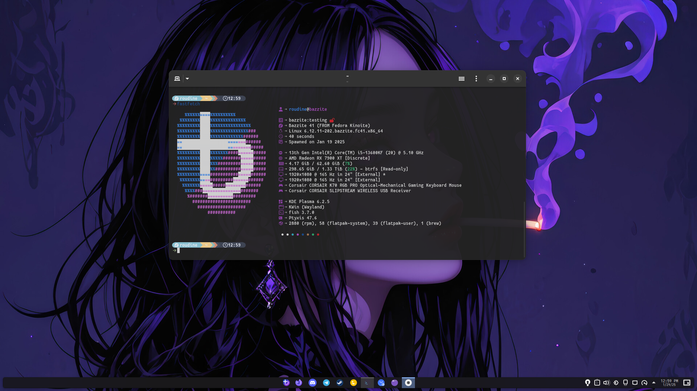

# Okadora
Custom Fedora Atomic Image for Desktops and Laptops. This is my take on what the modern Linux Desktop should look like.

# Purpose

This is an image that is built on the work of [Universal Blue](https://github.com/ublue-os), [Bazzite](https://github.com/ublue-os/bazzite), and [Fedora Silverblue](https://fedoraproject.org/silverblue/) projects.

The `Containerfile` is built directly off of [Bazzite](https://github.com/ublue-os/bazzite).

**This image is not recommended for general usage.**

If you want images designed for general consumption, I suggest using [Bazzite](https://github.com/ublue-os/bazzite) or [Bluefin](https://github.com/ublue-os/bluefin) from the Universal Blue project.

# Features

These are the features included in my image!

## Packages

In addition to the packages included in [Bazzite](https://github.com/ublue-os/bazzite), I include the following installed by default:

### Layered Packages (through RPM-Ostree)

#### System Administration

- Libvirtd, Qemu, and Virt-Manager

#### Programming

- VSCode
- Zed
- GH (Github CLI)
- NodeJS

#### Utilities

- scrcpy (used for controlling an android phone over USB)

### Git Repositories (simple clone)

- [FZF-Tab-Completion](https://github.com/lincheney/fzf-tab-completion)

### System Flatpaks


#### Programming

- Podman Desktop

### Utilities

- OBS Studio
- GPU Screen Recording (Maybe later)

### User Flatpaks

#### Before You will need to activate the flatpak user repo

**add flatpak user repo**
flatpak remote-add --if-not-exists flathub --user https://dl.flathub.org/repo/flathub.flatpakrepo

#### Optional

**install and add firefox nightly unofficial flatpak repo**
flatpak install --user https://gitlab.com/projects261/firefox-nightly-flatpak/-/raw/main/firefox-nightly.flatpakref

#### Browser

- Firefox (<-- It's just the best browser for me sorry)

#### Communications

- Discord (Layered)
- Vesktop (As backup)
- Element
- Telegram

#### Utilities

- Clapper
- Amberol
- Spotify

#### Gaming

- Prismlauncher
- Heroic Games
- Fightcade

#### Design

- Gimp

## Using the Image

If you do decide you want to try my image, you will want to rebase from Fedora Silverblue using this command:

```bash
rpm-ostree rebase ostree-unverified-registry:ghcr.io/okanilibe/okadora:latest
```

After rebase, you will need to run the command below to install all flatpaks that are shipped with Bazzite and Okadora

```bash
ujust _install-okadora-flatpaks
```

If there is demand, I may publish ISOs.

## Verification

These images are signed with sigstore's [cosign](https://docs.sigstore.dev/cosign/overview/). You can verify the signature by downloading the `cosign.pub` key from this repo and running the following command:

```bash
cosign verify --key cosign.pub ghcr.io/okanilibe/okadora
```

## Special Thanks

The contributors at Universal Blue, Bazzite, and Fedora are amazing. This image would not exist without the incredible work they do every day!
